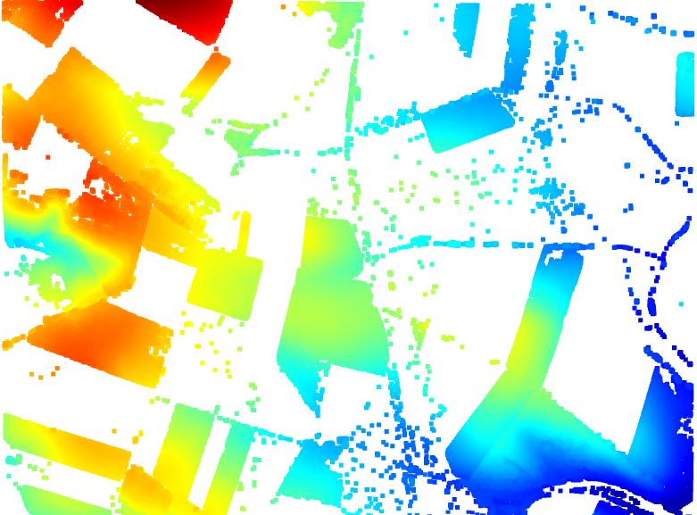

### Unsupervised Algorithms

Unsupervised algorithms allow us to work with large amounts of data without the need for prior classification, as they autonomously identify patterns and structures. These algorithms are useful in situations where labeled data is unavailable, or the nature of the data is unknown.

#### Types of Unsupervised Algorithms:
1. **Clustering**: These group the data into subsets or "clusters" based on their similarity. A common example is the **K-means algorithm**, which assigns data to groups based on the distance between points.
   
2. **Dimensionality Reduction**: These allow for simplifying data by reducing the number of variables while retaining as much relevant information as possible. An example is **Principal Component Analysis (PCA)**.

3. **Association Analysis**: This finds relationships between different variables within the data. It is commonly used in market analysis to identify purchasing patterns, such as the **Apriori algorithm**.

In summary, unsupervised algorithms are essential for exploring unknown data, uncovering hidden patterns, and extracting knowledge without needing a pre-labeled dataset.

You can find some LiDAR data from Spain at:
https://centrodedescargas.cnig.es/CentroDescargas/buscadorCatalogo.do?codFamilia=LIDAR

### Images

