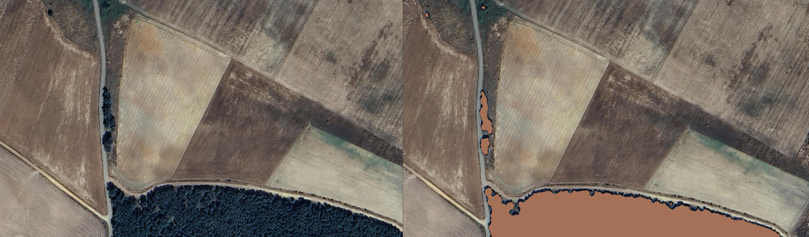

### Unsupervised Algorithms

Unsupervised algorithms allow us to work with large amounts of data without the need for prior classification, as they autonomously identify patterns and structures. These algorithms are useful in situations where labeled data is unavailable or the nature of the data is unknown.

One type of unsupervised algorithm is:

**Clustering**: These group the data into subsets or "clusters" based on their similarity. A common example is the **K-means algorithm**, which assigns data to groups based on the distance between points.

In this project, clustering will be used to detect the area occupied by tall vegetation. The use of **LiDAR** (Light Detection and Ranging) data allows for obtaining detailed information about the topography and structure of vegetation or buildings in urban environments. Through the analysis of LiDAR data, different types of cover can be identified and classified.

You can find some LiDAR data from Spain at:
[LiDAR Data from Spain](https://centrodedescargas.cnig.es/CentroDescargas/buscadorCatalogo.do?codFamilia=LIDAR)

### Images

